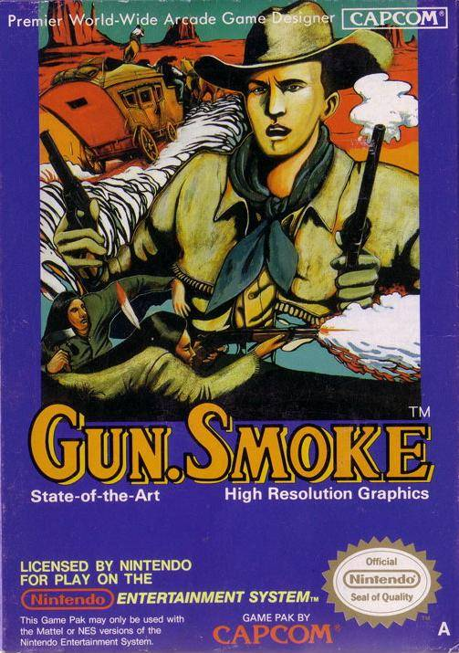

# Grandpa's Flip Flop Project 1: Gunsmoke

Gun.Smoke is a vertical scrolling arcade game made by Capcom in 1985. The game is a shooter with Western setting. The objective of the game is to find and catch 10 different criminals along 10 different stages. They will be the Final bosses at the end of every stage. The playable character can find some power ups and items that help to advance in every stage, however, the player has only 2 lives along every stage, and can shoot in 3 different directions (left diagonal, forward, and right diagonal) pushing 3 different buttons. The difficulty of the game is really high due the high quantity of enemies that appear in screen and shoot against the player from all directions, and the low movement speed of the character.

## Gun.Smoke Tribute

## Grandpa's Flip Flop Staff

Eric Navarro de Santiago: Q&A

Albert Cayuela Naval: Management

Marc Tarres : Code

## Game Controls

### KEYBORD CONTROLS

-Use up, left, right, down arrows to move the character.

-Use key C to left shoot, key V to front shoot, key B to right shoot.

-Use key F2 for godmode.

-Use key F1 to see the colliders.
  
-Use space for changing the scene when needed.

-Use escape for closing the game.

### GAMEPAD CONTROLS
  
-Use left joystick to move the character.
  
-Use x button to left shoot, y button to front shoot, b button for right shoot.
  
-Use a button for godmode.
  
-Use start button for changing the scene when needed.
  
-Use back button for closing the game.
## [Check a gameplay video]()!
## Dowload the latest version of Gun.Smoke [here](https://github.com/lakaens/Project-1/releases)!
## Check out our Github repositoire [here](https://github.com/lakaens/Project-1)!
## See more information in the Gun.Smoke [Wiki](https://github.com/lakaens/Project-1/wiki)!
